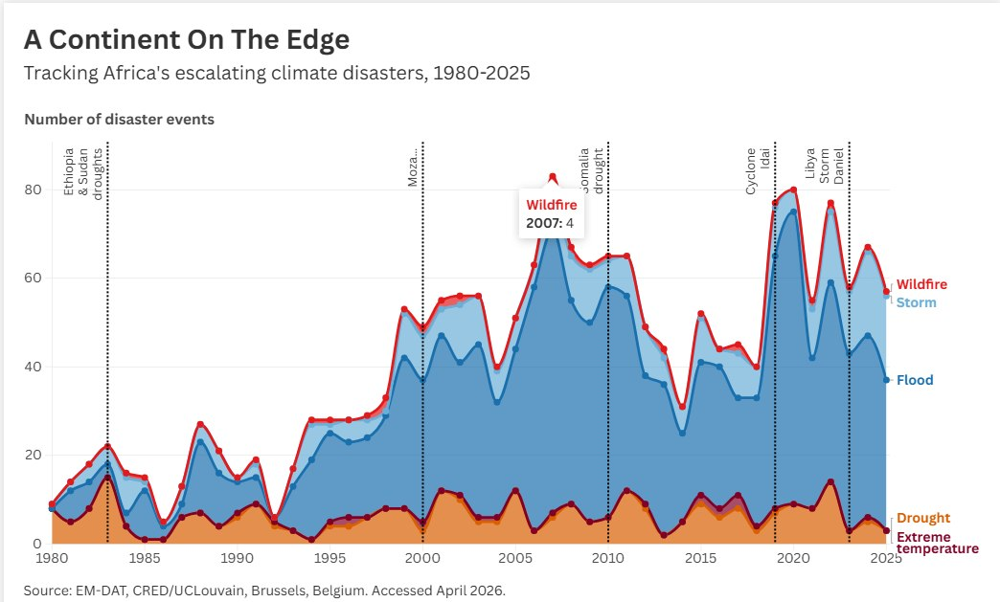
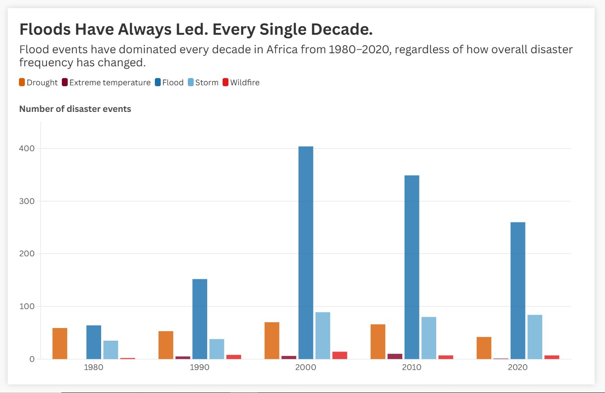

# Africa Climate Disaster Timeline
### A data storytelling project across two SWD challenges

---

## About This Project

This repository documents two Storytelling with Data (SWD) 
challenge submissions built from the same EM-DAT climate 
disaster dataset — exploring different stories hidden inside 
the same data.

Both projects were built by a Physics graduate from Lagos, 
Nigeria, using Python and Flourish, with a conviction that 
African climate data deserves more visibility in global 
data storytelling conversations.

---

## Challenge 1 — April 2026: Visualize a Timeline

### "A Continent on the Edge"
*Tracking Africa's escalating climate disasters, 1980–2025*

Before working on this project, I assumed Africa was largely
protected from climate change — after all, the continent 
contributes less than 4% of global CO₂ emissions.

I was wrong.

Tracking 1,883 climate disaster events across Africa over 
45 years, the data tells an uncomfortable truth: floods, 
droughts, storms, wildfires, and extreme temperatures have 
escalated dramatically — and the people least responsible 
for climate change are bearing the heaviest cost.

### Key Findings
- **1,883 climate disaster events** recorded across Africa 
  from 1980–2025
- A clear inflection point around **1999–2000**, after which 
  disaster frequency nearly doubled
- **Floods dominate** — the single largest disaster category 
  across the entire period
- A dramatic spike between **1995–2010** represents the most 
  concentrated period of climate disasters in modern African 
  history
- The last decade (2015–2025) shows sustained high frequency 
  with no signs of slowing

### Landmark Events Annotated

| Year | Event |
|------|-------|
| 1983 | Ethiopia & Sudan droughts — 450,000 deaths |
| 2000 | Mozambique floods — 800,000 displaced |
| 2010 | Somalia drought — 20,000 deaths |
| 2019 | Cyclone Idai — Mozambique & Zimbabwe |
| 2023 | Libya Storm Daniel — 13,200 deaths |

---

## Challenge 2 — June 2026: When Normal is Noteworthy

### "Floods Have Always Led. Every Single Decade."
*Flood events have dominated every decade in Africa 
from 1980–2020, regardless of how overall disaster 
frequency has changed.*

While everything about African climate disasters has 
changed — frequency, severity, geography — one thing 
has never changed: Floods are always number one.

1980s → Floods lead. 1990s → Floods lead. 2000s → Floods 
lead. 2010s → Floods lead. 2020s → Floods lead.

Floods are not like earthquakes. They are not like extreme 
heat. They are manageable — drainage systems, early warning 
infrastructure, flood-resilient roads, proper waste 
management. These are solvable problems.

Yet Flood has never once surrendered its position as 
Africa's most frequent climate disaster.

This is not a story of dramatic change. It is a story of 
persistent, preventable failure.

**The call to action:** Investment in water infrastructure, 
enforcement of drainage standards, and long-term urban 
planning that treats flood risk as permanent — because 
the data shows it is.

Floods don't have to lead. They keep leading because 
we keep letting them.

---

## Data Source

**EM-DAT** — The International Disaster Database  
CRED/UCLouvain, Brussels, Belgium  
[www.emdat.be](https://www.emdat.be)  
Accessed: April 2026

Filters applied: Natural disasters, Africa, 1980–2025,  
Climate-related types only (Flood, Storm, Drought, 
Wildfire, Extreme temperature)

> **Note:** Pre-2000 data is subject to reporting biases 
> per EM-DAT documentation. Some of the increase in 
> recorded events post-2000 reflects improved reporting 
> infrastructure, not only increased disaster frequency.

---

## Tools Used

| Tool | Purpose |
|------|---------|
| Python (pandas) | Data cleaning & aggregation |
| Google Colab | Analysis environment |
| Flourish | Interactive visualization |
| GitHub | Version control & portfolio |

---

## Methodology

1. Downloaded raw disaster data from EM-DAT (3,017 records)
2. Selected 5 relevant columns from 47 available
3. Filtered to climate-related disaster types only 
   (1,883 records)
4. Aggregated individual events by year and disaster type
5. Pivoted from long to wide format for Flourish 
   compatibility
6. Applied meaningful colour encoding by disaster category
7. For Challenge 2: created decade column using integer 
   division `(Start Year // 10) * 10` and aggregated 
   by decade

---

## Repository Structure
africa-climate-disaster-timeline/

│

├── README.md

├── notebook/

│   └── africa_climate_timeline.ipynb

├── data/

│   ├── africa_climate_wide.csv

│   ├── africa_climate_timeline.csv

│   └── africa_flood_dominance.csv

└── assets/

└── chart_preview.jpg

---

## How to Reproduce

1. Clone this repository
2. Open `notebook/africa_climate_timeline.ipynb` in 
   Google Colab
3. Upload your own EM-DAT export with the same filters
4. Run all cells in order
5. Upload the relevant CSV to Flourish

---

## About the Author

I am a Physics graduate (FUTO, 2025) building expertise 
in geospatial data science and AI/ML. This project sits 
at the intersection of my GIS background and a growing 
conviction that African voices and African data need to 
be better represented in global conversations about 
climate.

📍 Lagos, Nigeria  
🔗 [LinkedIn](https://linkedin.com/in/blessing-obasi-uzoma)

---

*Built for SWD April & June 2026 Challenges | 
Data: EM-DAT | Viz: Flourish*
